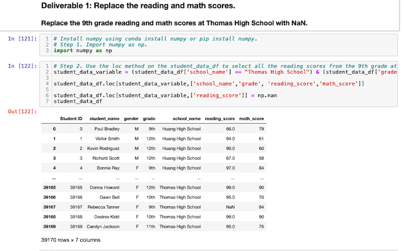

# School District Analysis.
## Overview of the project
A school board has notified evidence of academic dishonesty; specifically, reading and math grades for Thomas High School ninth graders appear to have been altered, so they have asked me to replace the math and reading scores for Thomas High School with NaNs while keeping the rest of the data intact, and repeat the analysis using Jupyter Notebook, Pandas and Python to make sure everything is fine.
## Resources
Data Source: PyCitySchools
Software: Python, Jupiter Notebook, Pandas, VSC
## Analysis and Results
We had to cleanup the data and replace reading and math scores for the ninth grade at Thomas High School with NaNs.

1. How is the district summary affected?
  - The only change is a little drop in math average between the two analyses
  
  
2. How is the school summary affected?
  - Both math and reading scores drop so THS is in the bottom
3. How does replacing the ninth graders’ math and reading scores affect Thomas High School’s performance relative to the other schools?
  - THS´s scores made THS the 7th highest score insted of top 5
  
  
4. How does replacing the ninth-grade scores affect the following:
  - Math and Reading scores by grade:
    - THS ninth math grades were higher compared with other  schools before the cleanup
  
  
  - Scores by school spending:
    - It gets to 63% overall passing percentage
    
  - Scores by school size:
    - It gets to 91% overall passing percentage
    
  - Scores by school type:
    - It gets to 90% overall passing percentage
    
